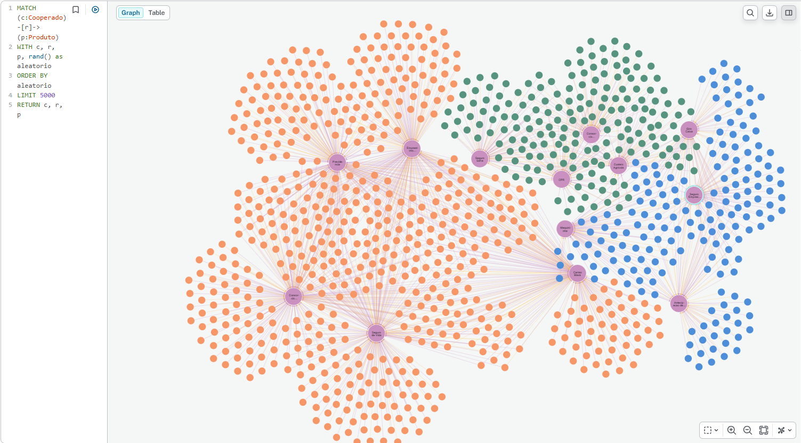
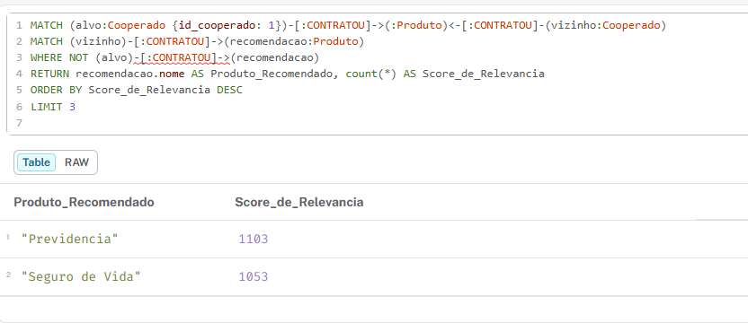
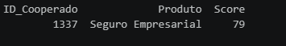

# Next Best Offer: Sistema de Recomendação para Cooperativas

Este projeto cria um sistema de recomendação de produtos financeiros pensado para cooperativas/bancos . A ideia é simples: ajudar a identificar quais produtos fazem mais sentido para cada cooperado, com base no comportamento de pessoas parecidas com ele.

Em vez de olhar apenas dados isolados, o sistema analisa padrões de consumo e características socioeconômicas para sugerir ofertas mais relevantes e personalizadas.

## Como o projeto funciona

O sistema utiliza uma combinação de dados de comportamento (o que as pessoas já contrataram ou pesquisaram) com informações de perfil (como renda e segmento). A partir disso, ele encontra cooperados com perfis e hábitos semelhantes e identifica quais produtos ainda não foram explorados por determinado cliente.

## Tecnologias utilizadas

- Linguagem: Python (Pandas e NumPy)  
- Banco de dados: Neo4j (banco orientado a grafos)  
- Lógica: Recomendação baseada em comportamento + perfil do cliente  

## Como os dados são organizados

O projeto utiliza uma estrutura em formato de grafo _dots_, que facilita enxergar conexões entre pessoas e produtos.

- **Cooperados**: possuem informações como idade, renda, segmento e tempo de relacionamento com a cooperativa  
- **Produtos**: possuem nome e categoria  
- **Conexões**: indicam se o cooperado contratou ou pesquisou um produto  

## O que as consultas fazem

[Consultas Cypher](queries.cypher)

### 1. Visualização de conexões

Mostra os cooperados divididos por PF, PJ e Agro e suas conexões com produtos. Isso ajuda a entender, de forma visual, como diferentes pessoas podem estar ligadas pelos mesmos interesses.

### 2. Motor de recomendação

Aqui está o coração do projeto. O sistema:

- Identifica o que o cliente já possui  
- Encontra outros cooperados com comportamento semelhante  
- Analisa quais produtos essas pessoas contrataram  
- Remove o que o cliente já tem  
- Sugere novos produtos com base no que é mais comum entre esse grupo  

### 3. DB

Como foi minha primeira vez usando o neo eu optei por mockar a database para facilitar, já que o foco era a plataforma

## Lógica por trás das recomendações

O sistema vai além de simplesmente sugerir produtos parecidos. Ele tenta encontrar pessoas realmente comparáveis ao cliente.

O processo segue estes passos:

1. Identifica os produtos que o cliente já possui  
2. Busca outros cooperados com esses mesmos produtos  
3. Filtra apenas aqueles com perfil semelhante (mesmo segmento e renda próxima, com variação de até 20%)  
4. Calcula quais produtos ainda não utilizados têm maior chance de interesse, com base na frequência dentro desse grupo no caso do exemplo 79 pessoas tem o mesmo perfil e contrataram seguro 
